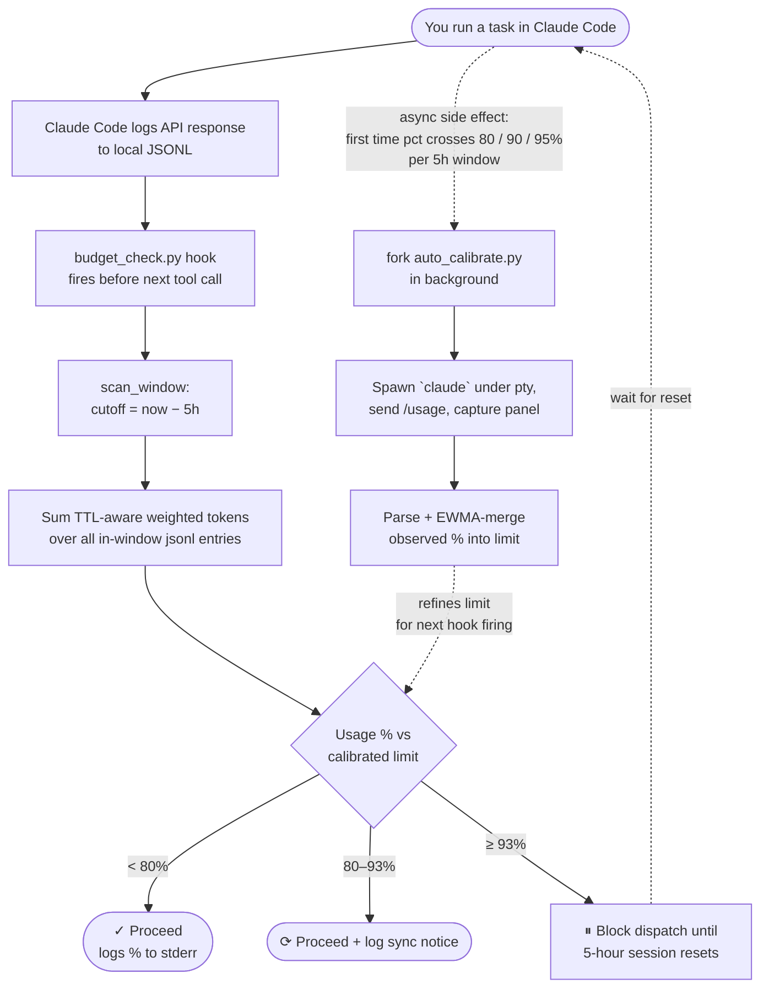

# claude-session-budget

Track Claude Code's 5-hour session usage locally — and automatically pause task queues before hitting the limit.

> **Discovered by reverse-engineering `~/.claude/projects/**/*.jsonl`**  
> No API calls. No web scraping. Pure local file parsing.

## The Problem

Claude Code enforces a **rolling 5-hour session limit**. When running automated task queues or background agents, the session can hit its limit mid-task with no warning.

## How It Works



Claude Code writes every API response to local JSONL files:
~/.claude/projects/<project-path>/<session-id>.jsonl

Each assistant message contains token counts in a `usage` field. The hook
sums these with cost-equivalent weights (TTL-aware for cache writes) and
divides by a calibrated limit to estimate session usage in real time. Two
self-correction paths keep that limit honest: a structural detector for
real `429 / rate_limit` API errors in the JSONL, and a background worker
that drives `claude /usage` itself when the estimate first crosses each
of `BUDGET_AUTO_CAL_MILESTONES` (default `80, 90, 95%`) — see
[Background auto-calibration](#background-auto-calibration-zero-user-input)
below. The user never has to copy-paste anything for either path.

### Why no `bridge_status` anchor?

Earlier versions used `type=system, subtype=bridge_status` lines as a "5h
session start" anchor. That turned out to be wrong: Claude Code emits a
`bridge_status` whenever `/remote-control` attaches to a *new CLI session*,
not when the underlying 5h Max window begins. Real users open `claude` many
times within one 5h window, so anchoring on the most recent `bridge_status`
silently leapt the cutoff forward and reset the budget count to ~0%
mid-window. We now use a plain rolling-5h cutoff and ignore `bridge_status`
entirely.

This means we cannot pinpoint the exact moment Anthropic's server-side 5h
window started — the rolling-5h estimate is off by however much idle time
preceded the earliest in-window jsonl message. In practice that's usually
a few minutes; the fallback `oldest = earliest in-window usage ts` keeps
the reset-time estimate within the same ballpark as `/usage`.

### Token Weighting (cost-equivalent, input = 1.0)

Weights mirror Anthropic's published list-price ratios so the weighted
total approximates dollar cost — the dimension the 5h Max cap actually
tracks.

| Token Type | Weight | Notes |
|---|---|---|
| input_tokens | 1.00× | base |
| output_tokens | 5.00× | |
| cache_read_input_tokens | 0.10× | |
| `cache_creation.ephemeral_5m_input_tokens` | 1.25× | default cache TTL |
| `cache_creation.ephemeral_1h_input_tokens` | **2.00×** | extended cache TTL |
| `cache_creation_input_tokens` (legacy) | 1.25× | fallback when no TTL breakdown |

The per-TTL breakdown landed in newer Claude Code builds; older jsonl
entries that only carry the flat `cache_creation_input_tokens` field are
weighted at 1.25× (the historical default and a safe lower bound). When
both fields are present in the same entry, the breakdown supersedes the
legacy field to avoid double-counting.

### Calibration

The calibrated limit is **auto-learned** from real Anthropic API errors:

1. Every time `budget_check.py` runs, it inspects each in-window jsonl entry
   for the **structural API-error signature**:
   `type=system, subtype=api_error` with HTTP `status=429`, or any nested
   `error.type` containing `rate_limit` / `usage_limit`.
2. When it finds a new event, it takes the weighted token total at that
   moment as a real-world `100%` reading.
3. The stored limit is EWMA-merged with the observation (default α=0.3) and
   written to `~/.claude/.budget_calibration.json`.

> **Why structural matching, not text?**
> An earlier version regex-matched `"rate limit"` / `"limit reached"` in the
> raw jsonl line. That picked up *any* user/assistant message body that
> mentioned the topic — including conversations debugging this very tool —
> and produced a self-poisoning EWMA loop that drove the calibrated limit
> from 63M down to 16M, causing false 100% BLOCKING. Structural signature
> matching eliminates that class of false positive.

You can also seed/refine the limit manually with one `/usage` reading:

```bash
# Mode A — explicit percentage
python3 scripts/calibrate.py --observed-pct 67

# Mode B — paste the full /usage panel; we extract the % for you
pbpaste | python3 scripts/calibrate.py --from-stdin
```

Known baselines (used until auto-learning kicks in):
- **Claude Max (5x):** ~63,226,913 weighted tokens = 100% (measured 2026-05-09)
- **Claude Pro:** unknown — contributions welcome

### Background auto-calibration (zero user input)

| Platform | Backend | Out-of-the-box |
|---|---|---|
| macOS / Linux | stdlib `pty` + `subprocess.Popen` | ✅ works as-is |
| Windows | `pywinpty` (ConPTY wrapper) | ⚙️ `pip install pywinpty` once |

On Windows without `pywinpty`, [`auto_calibrate_supported()`](scripts/_budget_core.py)
returns False and the hook silently skips dispatch — the base jsonl-scan
estimation still works, you just lose the periodic server-truth refinement.
Either install pywinpty (`pip install "claude-session-budget[windows]"`)
or use the manual `--from-stdin` path above.

The hook runs [`auto_calibrate.py`](scripts/auto_calibrate.py) in the
background when `pct` first crosses each milestone in `BUDGET_AUTO_CAL_MILESTONES`
(default `80,90,95`). The worker:

1. Spawns `claude` under a pseudo-terminal so slash commands work.
2. Sends `/usage` once the input prompt renders.
3. Captures the panel, ANSI-strips, parses the `Current session NN%` row.
4. EWMA-merges into the calibration file and exits.

Designed to need **zero user interaction** — no copy-paste, no extra terminal.
Cooldown of `BUDGET_AUTO_CAL_COOLDOWN_SECS` (default 300s) prevents bursts;
each milestone fires AT MOST once per 5h window. Worst case: 3 spawns per
window, each adding one `claude` startup's worth of cache-write tokens.

Disable entirely with `BUDGET_AUTO_CAL_ENABLED=0`. Inspect activity:

```bash
tail -20 ~/.claude/.budget_auto_calibrate.log
```

Manual one-shot run (useful for smoke-testing the spawn pipeline under
limit):

```bash
python3 scripts/auto_calibrate.py
```

## Installation

### Option A — Claude Code Plugin Marketplace (Recommended)

This repo is itself a Claude Code marketplace. Inside Claude Code:

```
/plugin marketplace add Star001-KR/claude-session-budget
/plugin install session-budget
```

The PreToolUse hook is wired automatically via [hooks/hooks.json](hooks/hooks.json),
the [skill](skills/budget-check/SKILL.md) becomes available as
`/session-budget:budget-check`, and all scripts run from `${CLAUDE_PLUGIN_ROOT}/scripts/`.

### Option B — Homebrew

```bash
brew tap Star001-KR/claude-session-budget https://github.com/Star001-KR/claude-session-budget
brew install Star001-KR/claude-session-budget/claude-session-budget
```

This installs the `budget-check` and `budget-calibrate` commands into
`$(brew --prefix)/bin`. To wire `budget-check` as a Claude Code PreToolUse
hook, add to `~/.claude/settings.json`:

```json
{
  "hooks": {
    "PreToolUse": [
      {
        "matcher": "*",
        "hooks": [{"type": "command", "command": "/opt/homebrew/bin/budget-check"}]
      }
    ]
  }
}
```

### Option C — PyPI

```bash
pip install claude-session-budget
```

This installs the `budget-check` and `budget-calibrate` console scripts and
makes the package importable as `claude_session_budget`. Wire `budget-check`
as a Claude Code PreToolUse hook the same way as the brew option (the binary
will be on your `$PATH`):

```json
{
  "hooks": {
    "PreToolUse": [
      {
        "matcher": "*",
        "hooks": [{"type": "command", "command": "budget-check"}]
      }
    ]
  }
}
```

For PM-layer / orchestrator integration:

```python
from claude_session_budget.session_budget_manager import SessionBudgetManager

budget = SessionBudgetManager()
status = budget.get_status()
```

### Option D — Manual Hook (no plugin, no brew, no pip)

```bash
curl -fsSL https://raw.githubusercontent.com/Star001-KR/claude-session-budget/main/install.sh | bash
```

The installer pins to the tagged release and verifies downloaded scripts
against `SHA256SUMS` from that release before writing to `~/.claude/hooks`.

Or manually add to `~/.claude/settings.json`:

```json
{
  "hooks": {
    "PreToolUse": [
      {
        "matcher": "*",
        "hooks": [{"type": "command", "command": "python3 ~/.claude/hooks/budget_check.py"}]
      }
    ]
  }
}
```

### Option E — Claude Code Skill (manual copy)

```bash
mkdir -p .claude/skills/session-budget
cp skills/budget-check/SKILL.md .claude/skills/session-budget/SKILL.md
cp scripts/budget_check.py .claude/skills/session-budget/check.py
```

### Option F — PM Layer / Orchestrator (manual)

```python
import sys; sys.path.insert(0, "scripts")  # or install as a package
from session_budget_manager import SessionBudgetManager

budget = SessionBudgetManager()

async def dispatch_task(task):
    wait_secs = await budget.check_before_dispatch()
    if wait_secs:
        await asyncio.sleep(wait_secs)
    # Optional: log current state for dashboards / observability
    s = budget.get_status()
    log.info(f"{s['pct']}% — resets in {s['remaining_str']} (epoch={s['reset_at']})")
```

`get_status()` returns a dict with both raw numbers and a human-friendly
remaining string:

```python
{
  "pct": 13.2,
  "weighted_tokens": 2_128_235,
  "calibrated_limit": 63_226_913,
  "reset_at": 1778355198.018,        # epoch seconds (anchor + 5h, or oldest msg + 5h)
  "remaining_secs": 16_755,
  "remaining_str": "4h 39m",         # or "already reset" when remaining == 0
}
```

## Thresholds

| Threshold | Default | Behavior |
|---|---|---|
| Sync | 80% | Re-reads JSONL and logs updated estimate |
| Pause | 93% | Blocks by default; optional hook sleep mode can wait and re-check |

Set thresholds via env vars **or** a `.env` file (loaded automatically):

```bash
BUDGET_SYNC_PCT=80 BUDGET_PAUSE_PCT=93 python3 scripts/budget_check.py
```

`.env` lookup order — process env always overrides:

1. `~/.claude/.env` (global default, always loaded)
2. `./.env` (current working directory) — **opt-in**: set
   `BUDGET_LOAD_PROJECT_ENV=1` to enable the per-project override
3. Built-in defaults

> **Migration from <1.1.4**: `./.env` is no longer auto-loaded by default.
> To restore per-project override behavior, add `BUDGET_LOAD_PROJECT_ENV=1`
> to `~/.claude/.env` (or your shell env).

Copy `.env.example` to get started:

```bash
cp .env.example ~/.claude/.env
```

## Pause Modes

By default, `budget_check.py` blocks immediately when usage reaches the pause
threshold. Leave `BUDGET_PAUSE_MODE` unset, empty, or set to `block`:

```bash
BUDGET_PAUSE_MODE=block
```

You can opt into sleep mode:

```bash
BUDGET_PAUSE_MODE=sleep
BUDGET_RECHECK_SECS=60
BUDGET_RESET_GRACE_SECS=60
BUDGET_MAX_SLEEP_SECS=14400
```

In sleep mode, the PreToolUse hook process stays alive, periodically re-checks
local JSONL usage, and exits `0` once usage falls below the pause threshold.
This lets the original tool call continue after the 5-hour window has rolled
forward enough. Before resuming, it sleeps `BUDGET_RESET_GRACE_SECS` and checks
one more time.

### Important Risks

Sleep mode is experimental and disabled by default.

- The hook process may remain alive for minutes or hours.
- Claude Code, your shell, terminal, OS, or task runner may impose timeouts.
- The UI can appear stuck while the hook is sleeping.
- If the reset estimate is wrong, the hook may still block after waiting.
- Sleep mode is best for supervised local use, not unattended automation.

For reliable queue pause/resume behavior, prefer `SessionBudgetManager` in an
orchestrator or PM layer.

## Environment Variables

All variables can be set in process env or `~/.claude/.env`. **Process env
always overrides.** `./.env` (cwd) is opt-in via `BUDGET_LOAD_PROJECT_ENV`.

| Variable | Default | Description |
|---|---|---|
| `BUDGET_SYNC_PCT` | `80` | Sync threshold (% of limit). At/above this, hook logs an estimate update |
| `BUDGET_PAUSE_PCT` | `93` | Pause threshold (% of limit). At/above this, hook blocks (or sleeps) |
| `BUDGET_PAUSE_MODE` | `block` | `block` → exit 2 immediately. `sleep` → keep hook alive, re-check periodically |
| `BUDGET_RECHECK_SECS` | `60` | sleep mode: jsonl re-scan interval |
| `BUDGET_RESET_GRACE_SECS` | `60` | sleep mode: extra wait after threshold drop, before resume |
| `BUDGET_MAX_SLEEP_SECS` | `14400` | sleep mode cap (4h). After this, hook gives up and exits 2 |
| `BUDGET_EWMA_ALPHA` | `0.3` | EWMA smoothing factor for auto-learned limit |
| `BUDGET_CALIBRATED_LIMIT` | *(unset)* | Hard override of stored calibrated limit (weighted tokens) |
| `BUDGET_PROJECTS_DIR` | `~/.claude/projects` | jsonl scan root |
| `BUDGET_CALIBRATION_FILE` | `~/.claude/.budget_calibration.json` | Persistence path for auto-calibration |
| `BUDGET_LOAD_PROJECT_ENV` | *(unset)* | Set to `1` to also load `./.env` from cwd at module import. Disabled by default to avoid an untrusted-cwd attack surface and import-time side effects |

## Disable / Uninstall

**Temporarily disable** (per-session): open `~/.claude/settings.json`, find the
`PreToolUse` entry whose `command` references `budget-check` (or
`budget_check.py`), and either remove that single entry from the array or
restart Claude Code after editing. Re-add it to re-enable.

**Full uninstall:**

```bash
# 1. Remove the hook entry from ~/.claude/settings.json
#    Delete the {"matcher": "*", "hooks": [{... "budget-check" ...}]} entry
#    from the "PreToolUse" array. (Leave the rest of the file alone.)

# 2. Remove the package — pick the matching path:
brew uninstall claude-session-budget                  # Option B (Homebrew)
pip uninstall claude-session-budget                   # Option C (PyPI)
rm -f ~/.claude/hooks/budget_check.py \
      ~/.claude/hooks/auto_calibrate.py \
      ~/.claude/hooks/_budget_core.py \
      ~/.claude/hooks/calibrate.py                    # Option D (install.sh)

# 3. Optional — clear auto-learned state and logs
rm -f ~/.claude/.budget_calibration.json \
      ~/.claude/.budget_auto_calibrate.log
```

Plugin install (Option A) uninstalls from inside Claude Code:

```
/plugin uninstall session-budget
```

If `install.sh` ever fails mid-run, it backs up your previous
`settings.json` to `~/.claude/settings.json.bak`; restore from there.

## Limitations

- Token weights are a **proxy** — Anthropic's internal formula is not public
- **Peak hours** (weekday 5–11am PT) consume limits faster
- **Cross-device usage** is not tracked (JSONL files are local only)
- **No exact server-side anchor**: we use a plain rolling-5h cutoff (see
  [Why no `bridge_status` anchor?](#why-no-bridge_status-anchor)). The
  reset-time estimate falls back to `earliest in-window usage ts + 5h`,
  which lags the true server window start by however much idle time
  preceded the first jsonl message
- The rate-limit `api_error` signature is **conservative** — accepts both
  `status=429` and any inner `error.type` containing `rate_limit`/`usage_limit`.
  The structural shape has been validated against real `status=401`/`502`
  captures, but no real `status=429` jsonl line has been observed yet (Claude
  Code likely surfaces rate-limit via stdout instead). Details and the
  refinement plan once a real 429 is captured live in
  [`docs/internals.md` Layer 3](docs/internals.md#layer-3--signature-matcher)
- Recalibrate after plan changes

## Files

| Path | Description |
|---|---|
| `.claude-plugin/plugin.json` | Plugin manifest (name, version, author, license) |
| `.claude-plugin/marketplace.json` | Marketplace manifest — lets `/plugin marketplace add` resolve this repo |
| `hooks/hooks.json` | PreToolUse hook declaration using `${CLAUDE_PLUGIN_ROOT}` |
| `skills/budget-check/SKILL.md` | Claude Code skill definition (auto-discovered as `/session-budget:budget-check`) |
| `scripts/budget_check.py` | Lightweight hook script (no deps); also runs auto-calibration |
| `scripts/session_budget_manager.py` | Full async class for PM/orchestrator integration |
| `scripts/calibrate.py` | Manual calibration entry from a `/usage` reading |
| `scripts/_budget_core.py` | Shared core: `.env` loader, JSONL scan, anchor detection, signature matcher, EWMA learner |
| `tests/test_budget_core.py` | Unit tests (86) — env loading, jsonl scan, signature matcher, EWMA, TTL-aware weighting, auto-calibration trigger, /usage parser |
| `.env.example` | Copy to `./.env` or `~/.claude/.env` |
| `install.sh` | One-line installer for the manual (non-plugin) hook setup |
| `Formula/claude-session-budget.rb` | Homebrew formula (used when this repo is added as a brew tap) |
| `pyproject.toml` | PyPI packaging metadata (PEP 517/621) — `pip install claude-session-budget` |
| `scripts/__init__.py` | Marks `scripts/` as the `claude_session_budget` package via `package-dir` mapping |
| `docs/internals.md` | Architecture deep-dive (anchor + 5h fallback + signature matcher + EWMA) |
| `LICENSE` | MIT |

## Contributing

PRs welcome — especially calibration values for Pro and Max 20x plans.

## License

MIT
