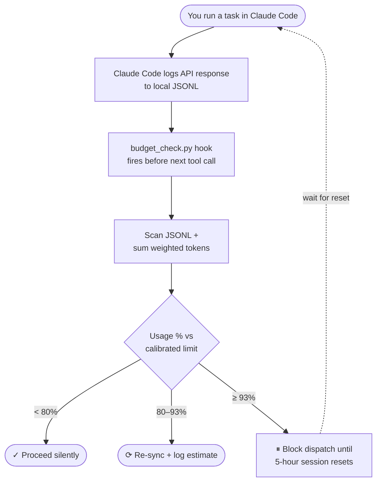

# claude-session-budget

Track Claude Code's 5-hour session usage locally — and automatically pause task queues before hitting the limit.

> **Discovered by reverse-engineering `~/.claude/projects/**/*.jsonl`**  
> No API calls. No web scraping. Pure local file parsing.

## The Problem

Claude Code enforces a **rolling 5-hour session limit**. When running automated task queues or background agents, the session can hit its limit mid-task with no warning.

## How It Works



Claude Code writes every API response to local JSONL files:
~/.claude/projects/<project-path>/<session-id>.jsonl

Each assistant message contains token counts in a `usage` field. By summing these with pricing-ratio weights and calibrating against one `/usage` observation, we estimate session usage in real time.

### Token Weighting (Opus pricing, input = 1.0)

| Token Type | Weight |
|---|---|
| input_tokens | 1.00× |
| cache_creation_input_tokens | 1.25× |
| cache_read_input_tokens | 0.10× |
| output_tokens | 5.00× |

### Calibration

The calibrated limit is **auto-learned** as you use Claude Code:

1. Every time `budget_check.py` runs, it scans recent JSONL for rate-limit / 5-hour-limit markers.
2. When it finds a new event, it takes the weighted token total at that moment as a real-world `100%` reading.
3. The stored limit is EWMA-merged with the observation (default α=0.3) and written to `~/.claude/.budget_calibration.json`.

You can also seed/refine it manually with one `/usage` reading:

```bash
python3 calibrate.py --observed-pct 67
```

Known baselines (used until auto-learning kicks in):
- **Claude Max (5x):** ~63,226,913 weighted tokens = 100% (measured 2026-05-09)
- **Claude Pro:** unknown — contributions welcome

## Installation

### Option A — Claude Code Hook (Recommended)

```bash
curl -fsSL https://raw.githubusercontent.com/Star001-KR/claude-session-budget/main/install.sh | bash
```

Or manually add to `~/.claude/settings.json`:

```json
{
  "hooks": {
    "PreToolUse": [
      {
        "matcher": "*",
        "hooks": [{"type": "command", "command": "python3 ~/.claude/hooks/budget_check.py"}]
      }
    ]
  }
}
```

### Option B — Claude Code Skill

```bash
mkdir -p .claude/skills/session-budget
cp skill/SKILL.md .claude/skills/session-budget/SKILL.md
cp budget_check.py .claude/skills/session-budget/check.py
```

### Option C — PM Layer / Orchestrator

```python
from session_budget_manager import SessionBudgetManager

budget = SessionBudgetManager()

async def dispatch_task(task):
    wait_secs = await budget.check_before_dispatch()
    if wait_secs:
        await asyncio.sleep(wait_secs)
```

## Thresholds

| Threshold | Default | Behavior |
|---|---|---|
| Sync | 80% | Re-reads JSONL and logs updated estimate |
| Pause | 93% | Blocks by default; optional hook sleep mode can wait and re-check |

Set thresholds via env vars **or** a `.env` file (loaded automatically):

```bash
BUDGET_SYNC_PCT=80 BUDGET_PAUSE_PCT=93 python3 budget_check.py
```

`.env` lookup order — first hit wins per key, but **process env always overrides**:

1. `./.env` (current working directory — per-project override)
2. `~/.claude/.env` (global default for all sessions)
3. Built-in defaults

Copy `.env.example` to get started:

```bash
cp .env.example ~/.claude/.env
```

## Pause Modes

By default, `budget_check.py` blocks immediately when usage reaches the pause
threshold:

```bash
BUDGET_PAUSE_MODE=block
```

You can opt into sleep mode:

```bash
BUDGET_PAUSE_MODE=sleep
BUDGET_RECHECK_SECS=60
BUDGET_RESET_GRACE_SECS=60
BUDGET_MAX_SLEEP_SECS=14400
```

In sleep mode, the PreToolUse hook process stays alive, periodically re-checks
local JSONL usage, and exits `0` once usage falls below the pause threshold.
This lets the original tool call continue after the 5-hour window has rolled
forward enough. Before resuming, it sleeps `BUDGET_RESET_GRACE_SECS` and checks
one more time.

### Important Risks

Sleep mode is experimental and disabled by default.

- The hook process may remain alive for minutes or hours.
- Claude Code, your shell, terminal, OS, or task runner may impose timeouts.
- The UI can appear stuck while the hook is sleeping.
- If the reset estimate is wrong, the hook may still block after waiting.
- Sleep mode is best for supervised local use, not unattended automation.

For reliable queue pause/resume behavior, prefer `SessionBudgetManager` in an
orchestrator or PM layer.

## Limitations

- Token weights are a **proxy** — Anthropic's internal formula is not public
- **Peak hours** (weekday 5–11am PT) consume limits faster
- **Cross-device usage** is not tracked (JSONL files are local only)
- Recalibrate after plan changes

## Files

| File | Description |
|---|---|
| `budget_check.py` | Lightweight hook script (no deps); also runs auto-calibration |
| `session_budget_manager.py` | Full async class for PM/orchestrator integration |
| `calibrate.py` | Manual calibration entry from a `/usage` reading |
| `_budget_core.py` | Shared core: `.env` loader, JSONL scan, EWMA learner |
| `.env.example` | Copy to `./.env` or `~/.claude/.env` |
| `install.sh` | One-line hook installer |
| `skill/SKILL.md` | Claude Code skill definition |

## Contributing

PRs welcome — especially calibration values for Pro and Max 20x plans.

## License

MIT
